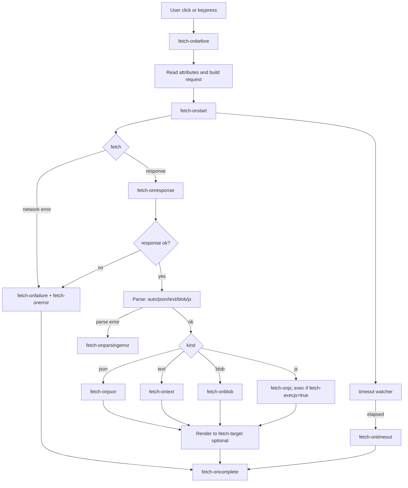

# afetch — Add fetch() to `<a>` and `<button>` via attributes
[](https://cdn.jsdelivr.net/gh/naveedurrehman/afetch/dist/afetch.min.js)
[](https://codepen.io/collection/zzBMba)


**afetch** is minimal JavaScript library for adding fetch() capabilities to &lt;a> and &lt;button> tags. **afetch** turns plain HTML into real apps: trigger **fetch()** with declarative attributes on `<a>` and `<button>`. No framework. No build step. Works anywhere.

---

## 🚀 5-second demo

```html
<script src="afetch.js"></script>

<a
  fetch="/api/hello"
  fetch-onjson="({data}) => alert(data.message)"
>
  Click Me!
</a>
```

---

## 🧪 Live Examples on CodePen

A collection of runnable **afetch** examples is available on CodePen. Browse it here: [CodePen collection](https://codepen.io/collection/zzBMba).

- [Example 1: Basic](https://codepen.io/naveedcoder/pen/OPywWzZ)
- [Example 2: Raw Data](https://codepen.io/naveedcoder/pen/jEbpzGQ)
- [Example 3: Form Data](https://codepen.io/naveedcoder/pen/LEpBdOR)
- [Example 4: Upload File](https://codepen.io/naveedcoder/pen/QwjBmOJ)
- [Example 5: Hooks Basic](https://codepen.io/naveedcoder/pen/pvjZLdY)
- [Example 6: Hooks for Parsed Data](https://codepen.io/naveedcoder/pen/vENaRpZ)
- [Example 7: Handling Errors](https://codepen.io/naveedcoder/pen/ZYbjxvd)
- [Example 8: Handling Timeout](https://codepen.io/naveedcoder/pen/vENaRdZ)
- [Example 9: No Cookies](https://codepen.io/naveedcoder/pen/RNWBMML)
- [Example 10: Dynamic](https://codepen.io/naveedcoder/pen/ZYbjxxg)
- [Example 11: Spinner](https://codepen.io/naveedcoder/pen/xbwJWME)
- [Example 12: Redirects](https://codepen.io/naveedcoder/pen/LEpBdqW)
---

## ✨ Why afetch?

- **Progressive enhancement, zero boilerplate.** Add a couple of `fetch-*` attributes to links or buttons and you’ve got async behavior—no framework, no controllers, no bundler required.
- **Predictable parsing.** `fetch-response="auto"` smart-parses by content type (JSON / text / blob / js), or you can force a mode per request for consistency across endpoints.
- **Drop-in rendering.** Point at any selector with `fetch-target` and choose how content lands (`fetch-target-format`, `fetch-target-mode`), so you can preview responses without writing DOM code.
- **Great with forms.** Use `fetch-forms` to collect fields (even across multiple forms) and optionally merge JSON via `fetch-body`. GET bodies become query params automatically.
- **Hooks everywhere.** From `fetch-onbefore` and `fetch-onstart` to `fetch-onjson`, `fetch-onfailure`, `fetch-ontimeout`, and `fetch-oncomplete`, you get clear, composable extension points—perfect for logging, analytics, and UI state.
- **UX niceties built-in.** `fetch-spinner` toggles spinners for you; `fetch-disabling` prevents double clicks; timeouts use `AbortController` for responsive UIs.
- **A11y-friendly defaults.** Upgraded anchors get `role="button"` and `tabindex="0"`, and controls set `aria-disabled` during requests.
- **Fetch-native.** Most `fetch-*` attributes map straight to the standard `window.fetch` init (method, headers, credentials, cache, redirect, referrer, referrer-policy), so it plays nicely with your existing APIs.
- **Framework-agnostic.** Works in plain HTML or alongside React/Vue/Svelte/Rails/Django/Laravel—you’re just enhancing markup.
- **Easy to scale.** New elements added later are auto-observed.

> **tl;dr** — afetch gives you the 80% you write over and over (wiring, parsing, rendering, and states) as HTML attributes and well-placed hooks, so you ship interactivity faster with less JavaScript.

---

## 🛠️ Attributes

| Attribute                                                                                                          | Type            |          Default | Possible values / notes                                                                                                                                                                                                   | Effect                                                      |
| ------------------------------------------------------------------------------------------------------------------ | --------------- | ---------------: | ------------------------------------------------------------------------------------------------------------------------------------------------------------------------------------------------------------------------- | ----------------------------------------------------------- |
| `fetch`                                                                                                            | string (URL)    |                — | Required. Relative or absolute URL.                                                                                                                                                                                       | Endpoint to request when the element is activated.          |
| `fetch-method`                                                                                                     | string          |            `GET` | Any valid `fetch()` method (e.g., `GET`, `POST`, …). If used with `fetch-forms` and you set `GET`/`HEAD`, the library auto-switches to `POST`.                                                                            | HTTP method.                                                |
| `fetch-mode` / `fetch-credentials` / `fetch-cache` / `fetch-redirect` / `fetch-referrer` / `fetch-referrer-policy` | string          |                — | Pass-through to `window.fetch` init. If not set, omitted.                                                                                                                                                                 | Controls lower-level fetch behavior.                        |
| `fetch-headers`                                                                                                    | JSON            |                — | Object of header key/values; merged into a `Headers` instance.                                                                                                                                                            | Additional request headers.                                 |
| `fetch-body`                                                                                                       | JSON            |                — | For `GET`/`HEAD`, becomes query params; otherwise serialized. If `Content-Type` is exactly `application/x-www-form-urlencoded`, it’s URL-encoded; otherwise defaults to JSON and sets `Content-Type: application/json`.   | Request payload.                                            |
| `fetch-forms`                                                                                                      | CSV (form IDs)  |                — | Collects fields from the listed forms into `FormData`. If `fetch-body` is also present, its JSON is merged into that `FormData`. Using `GET`/`HEAD` forces a `POST`.                                                      | Builds a `FormData` body from existing forms.               |
| `fetch-response`                                                                                                   | string          |           `auto` | `auto` (sniff content-type), `json`, `text`, `blob`. JavaScript (`application/javascript` / `text/javascript`) is parsed as `js`.                                                                                         | Selects how the response is parsed before hooks run.        |
| `fetch-execjs`                                                                                                     | boolean         |           `true` | Parsed with tolerant boolean tokens: `true/false`, `1/0`, `yes/no`, `on/off`, or presence-only. When the parsed kind is `js` and this is `true`, the script is executed.                                                  | Auto-executes JavaScript response bodies.                   |
| `fetch-timeout`                                                                                                    | number (ms)     | `0` (no timeout) | Any integer ≥ 0. On timeout, request is aborted and `fetch-ontimeout` fires.                                                                                                                                              | Aborts long-running requests.                               |
| `fetch-target`                                                                                                     | CSS selector    |           `null` | Any valid selector. If set, response preview is rendered there.                                                                                                                                                           | Where to render the response (preview).                     |
| `fetch-target-format`                                                                                              | string          |           `html` | `html` → uses `innerHTML`, anything else → `textContent`.                                                                                                                                                                 | How the preview is inserted.                                |
| `fetch-target-mode`                                                                                                | string/number   |    `0` (`reset`) | `reset`/`0`, `append`/`1`, `prepend`/`-1`.                                                                                                                                                                                | How the preview is positioned relative to existing content. |
| `fetch-spinner`                                                                                                    | CSS selector    |                — | Elements matching the selector are hidden initially and shown during the request; hidden again on completion.                                                                                                             | Simple show/hide spinner control.                           |
| `fetch-disabling`                                                                                                  | (presence-only) |                — | If present, the clicked control is `.disabled = true` during the request and restored afterwards. (Regardless, `aria-disabled` is set while active for accessibility.)                                                    | Prevents double submits.                                    |

---

## 🪝 Hooks

| Hook attribute                                                  | When it fires                                             | `detail` payload                                                                                        | Notes / common use                                                 |
| --------------------------------------------------------------- | --------------------------------------------------------- | ------------------------------------------------------------------------------------------------------- | ------------------------------------------------------------------ |
| `fetch-onbefore`                                                | Right before reading attributes and starting the request  | the element itself (`<a>`/`<button>`)                                                                   | Last chance to tweak the DOM/state.                                |
| `fetch-onstart`                                                 | After options are prepared; just before calling `fetch()` | `{ element, url, method, init: { headers, body } }`                                                     | Great for logging/telemetry.                                       |
| `fetch-onresponse`                                              | Immediately after `fetch()` resolves (even if not OK)     | `{ element, url, method, response }`                                                                    | Inspect status/headers early.                                      |
| `fetch-onfailure`                                               | On network error **or** non-OK responses                  | For non-OK: `{ element, url, method, error: parsed }`; on exceptions: `{ element, url, method, error }` | Fired alongside `fetch-onerror`.                                   |
| `fetch-onparsingerror`                                          | Response OK but parsing failed                            | `{ element, url, method, error, raw, response }`                                                        | You get `raw` best-effort text.                                    |
| `fetch-onjson` / `fetch-ontext` / `fetch-onblob` / `fetch-onjs` | After successful parse                                    | `{ element, url, method, data, response }`                                                              | For `onjs`, if `fetch-execjs` is `true`, the JS is also executed.  |
| `fetch-ontimeout`                                               | When `fetch-timeout` aborts the request                   | `{ element, url, method }`                                                                              | Triggered by an `AbortController`.                                 |
| `fetch-onfetchbodyerror`                                        | If building/merging `fetch-body` fails up-front           | `{ element, error }`                                                                                    | Useful for surfacing invalid JSON before sending.                  |
| `fetch-onerror`                                                 | Generic error companion                                   | `{ element, error }`                                                                                    | Emitted alongside specific error hooks for convenience.            |
| `fetch-oncomplete`                                              | Always, after success or failure                          | `{ element, url, method }`                                                                              | Final cleanup; spinner/disabling already reset.                    |
---

## 🔄 Request Lifecycle


